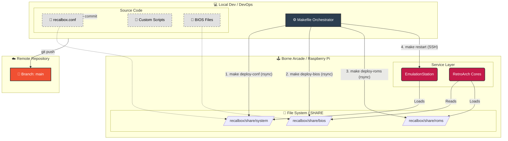
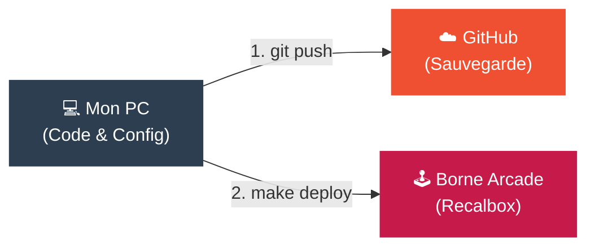

# Infrastructure Borne Arcade (Recalbox)







## GPIO Mapping
Le driver `mk_arcade_joystick_rpi` est activé. Brancher les sticks sur le header GPIO standard.


# 🎮 Borne d'Arcade Raspberry Pi


Créez votre **borne d'arcade rétro** avec un Raspberry Pi et jouez à vos jeux classiques préférés en quelques minutes ! Ce projet fournit une **configuration prête à l'emploi**, des instructions claires et une structure Git optimisée pour partager et sauvegarder vos ROMs, BIOS et configurations.

---

## 🚀 Objectif

- Avoir une **borne d'arcade fonctionnelle** sur Raspberry Pi.
- Tester rapidement des jeux rétro sans configuration complexe.
- Fournir un **répertoire Git structuré** pour gérer ROMs, BIOS et configs.

---

## 🛠 Matériel requis

- Raspberry Pi 3, 4 ou 400  
- Carte micro-SD (16 Go minimum)  
- Alimentation officielle Raspberry Pi  
- Manette USB ou Bluetooth  
- Écran HDMI  
- Câbles HDMI et alimentation  

---

## 💾 Logiciel recommandé

- **[Recalbox](https://www.recalbox.com)** – Simple, plug & play, large support de consoles et bornes arcade.  
- **Alternatives** :  
  - **Lakka** – Léger et rapide, parfait pour une expérience arcade fluide.  
  - **RetroPie** – Très modulable, idéal pour customiser et ajouter des fonctionnalités avancées.

---

## ⚡ Installation rapide

1. Télécharger l'image Recalbox adaptée à votre Raspberry Pi :  
   [https://www.recalbox.com/download](https://www.recalbox.com/download)
2. Flasher l'image sur la micro-SD avec [balenaEtcher](https://www.balena.io/etcher/).
3. Insérer la micro-SD dans le Raspberry Pi et démarrer.
4. Configurer la langue et la manette via l'interface.
5. Copier vos ROMs dans le dossier `ROMs` via réseau ou clé USB.

---

## 📂 Structure Git recommandée

recalbox-config/
├─ ROMs/ # Jeux rétro à placer ici
│ └─ README.md # Instructions pour ajouter vos ROMs
├─ bios/ # BIOS nécessaires pour certains émulateurs
│ └─ README.md # Liste des BIOS nécessaires
├─ overlays/ # Skins et overlays personnalisés
│ └─ default/ # Skins/overlays par défaut
├─ configs/ # Configuration des manettes et émulateurs
│ └─ controllers/ # Fichiers config des manettes
│ └─ gamepad.cfg # Exemple fourni ci-dessous
└─ README.md # Ce fichier


---

## 🎮 Exemple configuration manette

```cfg
# Exemple pour Recalbox
input_player1_a = "button_a"
input_player1_b = "button_b"
input_player1_x = "button_x"
input_player1_y = "button_y"
input_player1_start = "start"
input_player1_select = "select"
input_player1_l2 = "l2"
input_player1_r2 = "r2"


